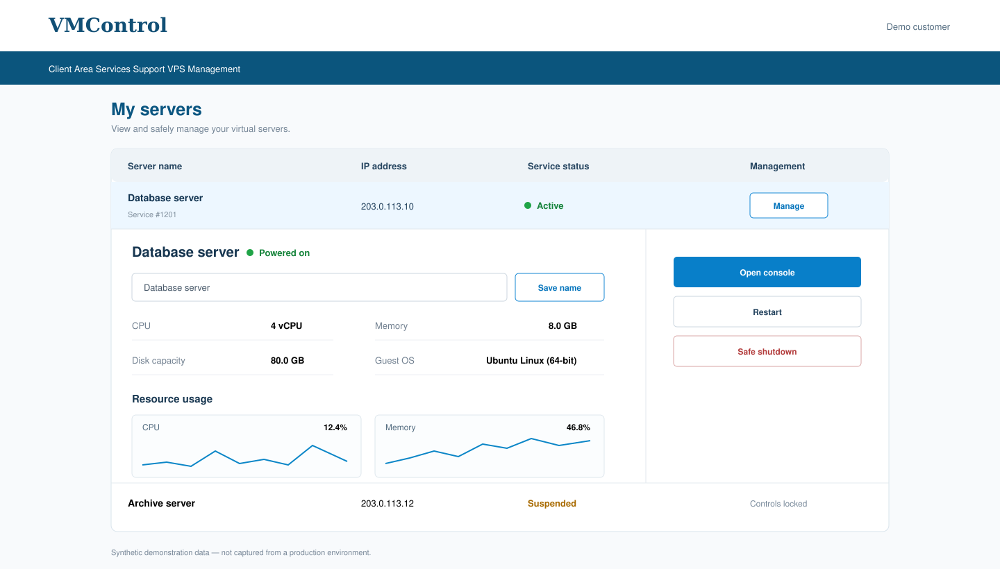
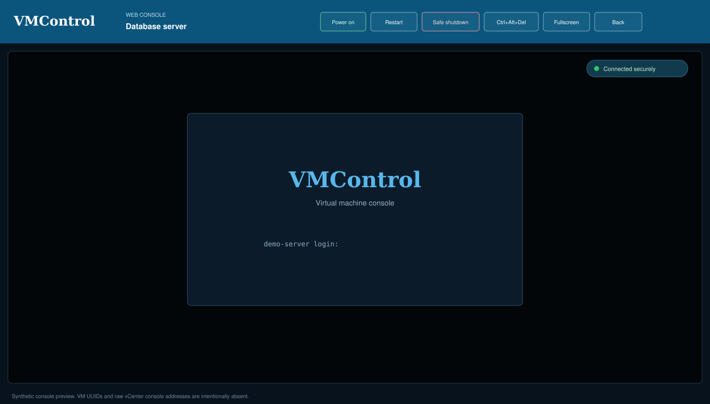

# VMControl Suite

VMControl adds a customer VPS management area to WHMCS while keeping vCenter
credentials and console traffic on a separate, isolated Gateway. It does not
modify WHMCS core files, themes, products, payment gateways, or vCenter VMs.

> Status: version 0.5.0 is the management-only release. Automated provisioning,
> operating-system templates, IP allocation, and network automation are planned
> for a later phase and are not part of this repository.

## What it provides

- Multiple VPSs per customer in one responsive WHMCS page.
- CPU, memory, provisioned disk capacity, guest OS, IP, and power state.
- Day, week, and month performance charts backed by vCenter metrics.
- Power on, guest reboot, safe guest shutdown, and WebMKS browser console.
- Customer-defined display names without revealing the vCenter VM name.
- Automatic lockout of controls when the WHMCS service is not `Active`.
- Administrator mapping, transfer, enable/disable, unlink, search, and CSV import.
- IP-based mapping suggestions that require explicit administrator confirmation.
- HMAC-authenticated backend API, replay protection, one-use console links, and
  JSONL audit logging.

## Screenshots

All values in these images are synthetic and were created specifically for the
public documentation. They are not captures of a production installation.

### Customer dashboard

### Administrator mapping workspace

### Browser console

## Architecture

The browser never receives vCenter credentials, raw WebMKS tickets, VM UUIDs,
or direct ESXi console addresses. WHMCS validates the logged-in customer and the
service status, then signs backend requests to the Gateway. The Gateway applies
its own vCenter, inventory-prefix, action, and console-network restrictions.

See [Architecture](docs/ARCHITECTURE.md) for the trust boundaries and request
flows.

| Component | Location | Responsibility |
|---|---|---|
| Gateway | `gateway/` | vCenter API, action policy, metrics, console sessions, WebSocket proxy |
| Caddy | `Caddyfile` | Public TLS and WHMCS source-IP restriction for `/api/*` |
| WHMCS addon | `whmcs/modules/addons/vmcontrol/` | Ownership/status checks, customer UI, administrator mapping |
| External config | `whmcs/config/` | Example HMAC configuration stored outside the web root |

## Compatibility

- Gateway host: Ubuntu 24.04 LTS or another supported Docker host.
- Docker Engine with Compose v2 or newer.
- VMware vCenter 7.x; the current release was validated against vCenter 7.0.3.
- WHMCS 8.13; the addon remains compatible with PHP 7.2.
- VMware HTML Console SDK 2.2.1 supplied separately under its vendor license.

## Installation

Use the complete [Installation guide](docs/INSTALL.md). In short:

1. Deploy the Gateway on a host separate from WHMCS.
2. Copy `.env.example` and `secrets/vcenters.example.json` to their ignored
   runtime filenames and fill them with deployment-specific values.
3. Supply the four required VMware HTML Console SDK assets.
4. Build and start the Docker Compose stack.
5. Copy the addon into WHMCS, create `/etc/whmcs-vmcontrol.php`, activate the
   addon, and assign one test service from its administrator page.

Never copy example credentials into production unchanged.

## Authorization behavior

| WHMCS service state | Listed for customer | Status/specs | Power/console/name changes |
|---|---:|---:|---:|
| Active | Yes | Yes | Yes |
| Pending | Yes | No | No |
| Suspended | Yes | No | No |
| Cancelled / Terminated / Fraud | No | No | No |

An enabled VMControl mapping is also required. Disabling or unlinking a mapping
immediately removes customer control without changing the WHMCS service or VM.

## Safe defaults

- Mappings are keyed by vSphere `config.instanceUuid`, never by a mutable name.
- Safe shutdown and guest reboot are enabled by default.
- Hard power-off and hard reset are excluded from the default action policy.
- IP matches are suggestions only; an administrator must confirm each mapping.
- A fresh inventory check runs immediately before an IP suggestion is saved.
- Console launch URLs are short-lived, one-use, and converted into a cookie-bound
  same-origin session.
- The vCenter account and each inventory prefix provide an independent scope.

## Operations and upgrades

- [Operations and rollback](docs/OPERATIONS.md)
- [Gateway API](docs/API.md)
- [Upgrade to 0.5.0](docs/UPGRADE-0.5.0.md)
- [Security policy](SECURITY.md)
- [Changelog](CHANGELOG.md)

## License and third-party assets

VMControl is released under the [MIT License](LICENSE). VMware HTML Console SDK
files are not included and are not covered by this project's license. Obtain
them from Broadcom/VMware and review their license before deployment.
