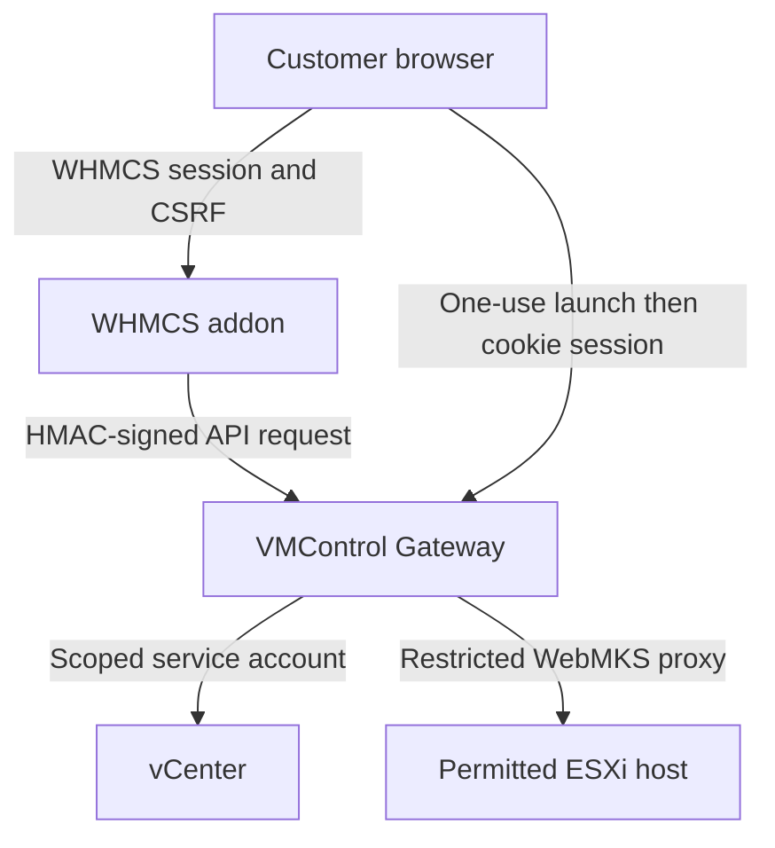

# Architecture and trust boundaries

VMControl separates billing identity and ownership from infrastructure access.
WHMCS remains authoritative for customers and service state; the Gateway is the
only component allowed to authenticate to vCenter.

## Control flow

1. WHMCS checks the authenticated customer owns the mapped service.
2. WHMCS requires both the service status `Active` and mapping `enabled` for
   status, rename, actions, metrics, and console.
3. The addon signs method, escaped path, timestamp, nonce, and exact body hash.
4. The Gateway validates key, HMAC, clock skew, and nonce replay before routing.
5. The Gateway selects a configured vCenter and rejects VMs outside its allowed
   inventory prefixes.
6. vCenter authorizes the operation again through the scoped service account.

## Console flow

1. WHMCS requests a console launch while sending service/user audit identifiers
   and a customer-facing display name.
2. The Gateway obtains a WebMKS ticket and stores the sensitive VM and endpoint
   data in memory.
3. WHMCS redirects the browser to a short-lived opaque launch URL.
4. The launch token is consumed once and replaced by a secure, HTTP-only,
   same-site cookie.
5. Browser controls and WebSocket traffic use same-origin `/console/*` routes.
6. The Gateway connects only to endpoints inside `CONSOLE_ALLOWED_CIDRS`.

The customer-facing HTML and browser paths contain neither an instance UUID nor
a raw vCenter/ESXi console URL.

## Stored data

WHMCS stores a one-to-one mapping between a WHMCS service ID and the vSphere
instance UUID, a customer display name, enable state, last observed power state,
administrator ID, and timestamps. Activity records contain sanitized action
metadata. The Gateway audit log is JSON Lines and must be protected as
operational data even though console tickets and API secrets are not logged.

## Failure isolation

- If the Gateway is unavailable, existing WHMCS billing, payment, ticket, and
  product workflows continue; the VPS page shows a temporary management error.
- If vCenter is unavailable, the Gateway returns an error without changing WHMCS.
- Deactivating the addon removes its navigation/UI while preserving mappings.
- Stopping the Gateway does not affect running VMs.

## Explicit non-goals in 0.5.0

- Creating, cloning, resizing, deleting, or renaming vCenter VMs.
- Allocating IPs or changing DHCP, firewall, virtual network, or anti-spoofing state.
- Installing or reinstalling operating systems.
- Processing invoices or altering WHMCS service lifecycle state.
